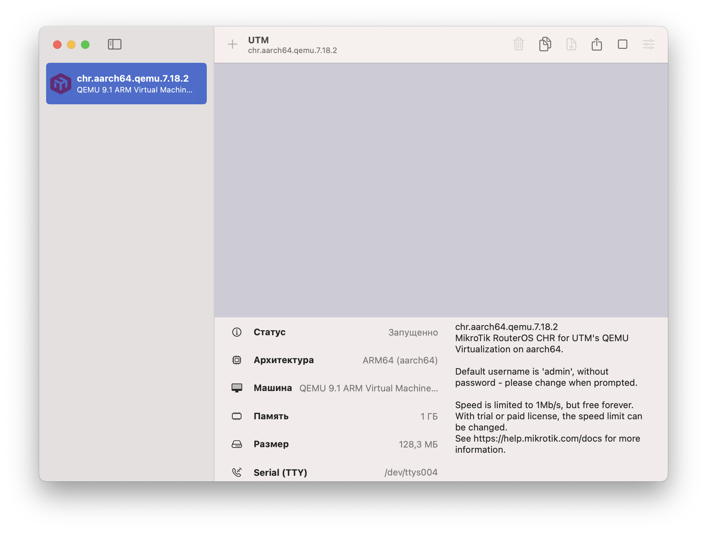
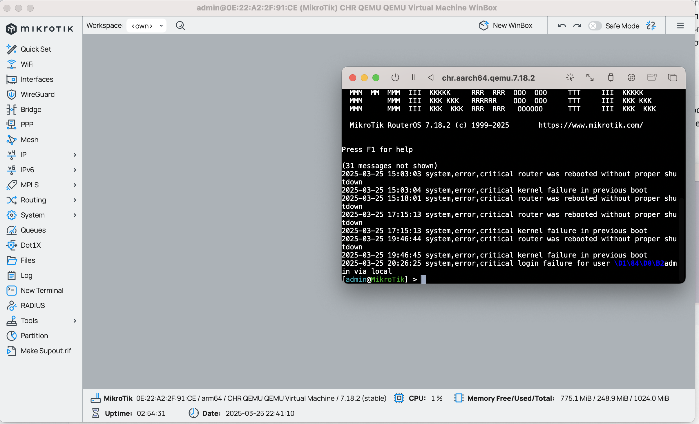
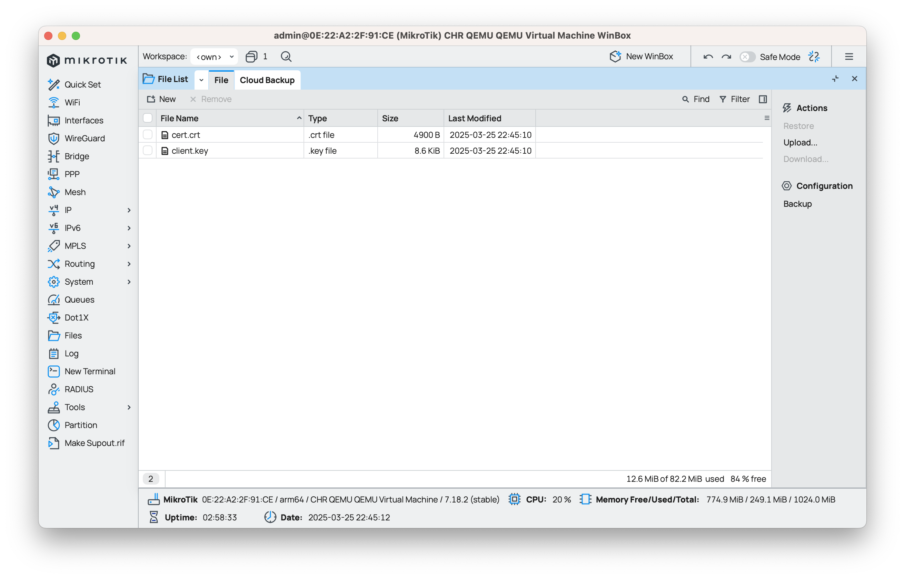
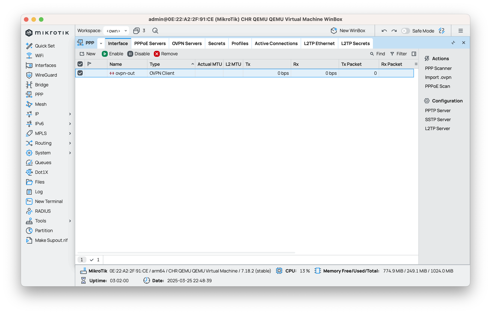
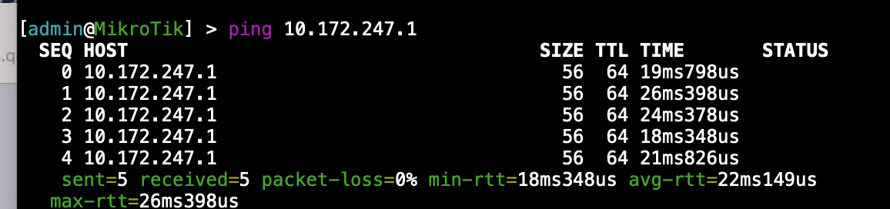
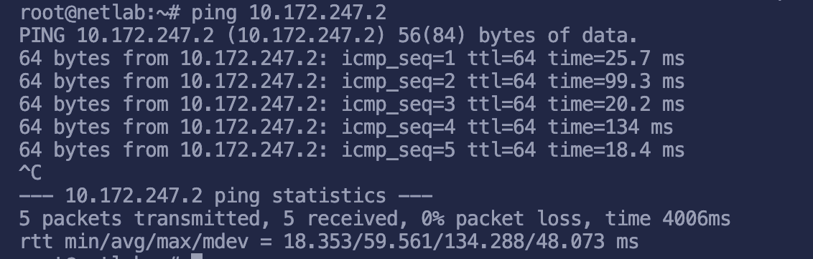
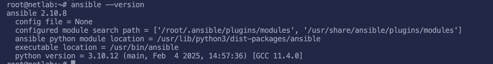

University: [ITMO University](https://itmo.ru/ru/)

Faculty: [PIN](https://fict.itmo.ru)

Course: [Introduction in routing](https://github.com/itmo-ict-faculty/introduction-in-routing)

Year: 2024/2025

Group: K3320

Author: Skvorcov Ivan Vladimirovich

Lab: [Lab1](https://itmo-ict-faculty.github.io/network-programming/education/labs2023_2024/lab1/lab1/)

Date of create: 22.03.2025

Date of finished: 26.03.2025


## Настройка  open vpn сервера

Для установки open vpn использовался готовый [скрипт](https://github.com/unixhostpro/mikrotik-ovpn). В нем генерируются необходимые сертификаты для сервера и клиента. Посмотрим, что находится в итоговом конфиге, сгенерированном скриптом. 

```
daemon
mode server
tls-server
port 1984
proto tcp
dev tun1984
log /var/log/openvpn-1984.log
status /var/log/openvpn-status-1984.log
ca /etc/openvpn/mikrotik-ssl/ca-1984.crt
cert /etc/openvpn/mikrotik-ssl/server-1984.crt
key /etc/openvpn/mikrotik-ssl/server-1984.key
dh /etc/openvpn/mikrotik-ssl/dh2048-1984.pem
topology subnet
server 10.172.247.0 255.255.255.0
client-to-client
ifconfig-pool-persist ipp.txt
username-as-common-name
push "dhcp-option DNS 1.1.1.1"
push "dhcp-option DNS 8.8.8.8"
user nobody
group nogroup
keepalive 10 120
persist-key
persist-tun
auth sha1
cipher AES-256-CBC
verb 5
script-security 2
up /etc/openvpn/server-up.sh
down /etc/openvpn/server-down.sh
plugin /usr/lib/x86_64-linux-gnu/openvpn/plugins/openvpn-plugin-auth-pam.so login
```

Тут интересует последняя строка с подключением плагина, она позволяет авторизоваться по логину и паролю через отдельного пользователя. Предыдущие попытки настроить авторищацию по ключу были неуспешными. Подключение проходило с ноутбука, но при поптыке потключения к серверу с вм chr возникали ошибки. 

## Установка виртуальной машины
Для разворачивания виртуальной маины использовалось ПО UTM. Готовые и настроенные образы были взяты из [репозитория](https://github.com/tikoci/mikropkl). В моем случае был взят образ chr.aarch64.qemu.7.18.2.utm



После запуска виртуальной машины подключаемся к ней чрез winbox



## Подключение RouterOS к openVPN серверу

Скопируем на роутер необходимые файлы (ключ и сертификат). 




Далее установим сертификат (system -> certificates -> import) и создадим openvpn соединение (ppp -> new), указав в нем необходимые параметры и прописав логин с паролем для авторизации. Этот шаг можно было сделать создав ovpn файл, содержаший внутри конфиг для клиента и необходимые ключи.



Проверим, что все работает. Для этого пинганем роутер с удаленной виртуальнйо машины и наоборот




Как мы видим пинги прошли успешно. 

## Уставнока ansible

