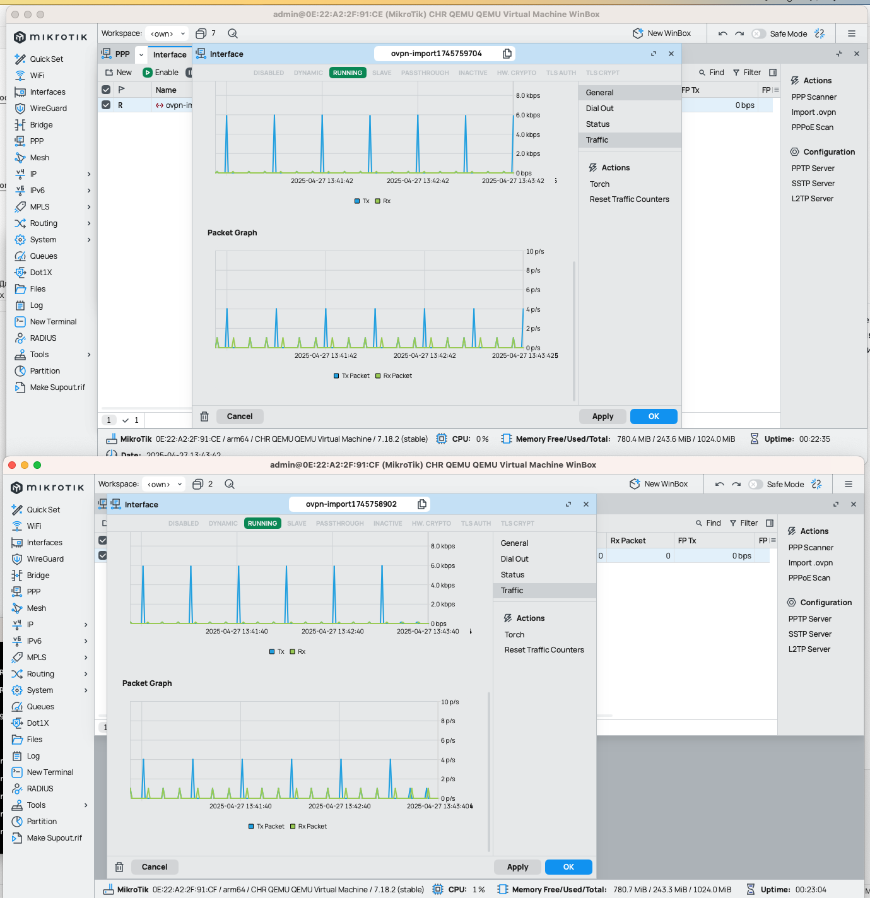
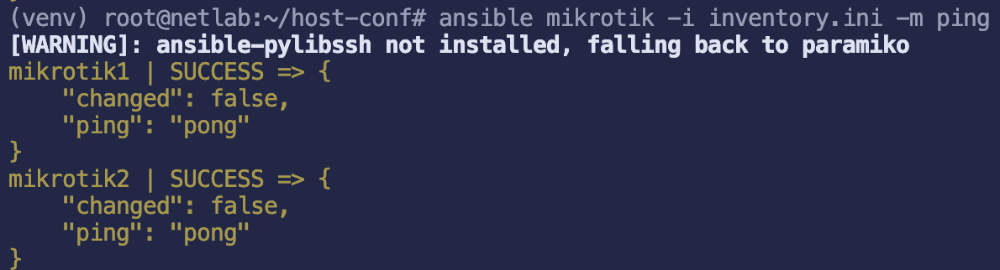
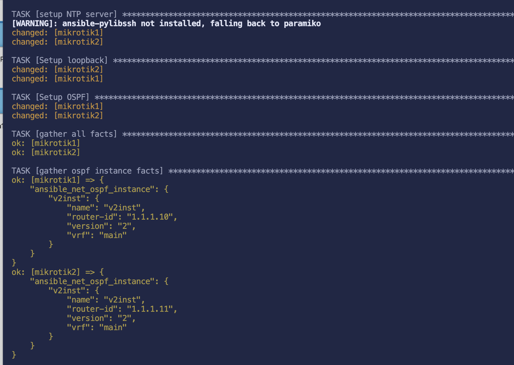
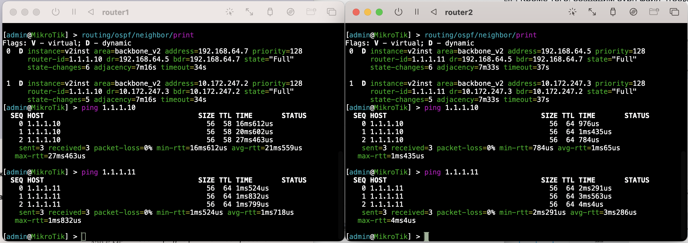

University: [ITMO University](https://itmo.ru/ru/)

Faculty: [PIN](https://fict.itmo.ru)

Course: [Introduction in routing](https://github.com/itmo-ict-faculty/introduction-in-routing)

Year: 2024/2025

Group: K3320

Author: Skvorcov Ivan Vladimirovich

Lab: [Lab2](https://itmo-ict-faculty.github.io/network-programming/education/labs2023_2024/lab1/lab1/)

Date of create: 12.04.2025

Date of finished: 13.04.2025

## Подготовка 

В данной работе нужно подключить вторую виртуальную машину в vpn серверу. Для упрощения внесем изменение в конфигурацию сервера, чтобы используя одни данные для подключения можно было использовать для несколких клиентов. С этой целью была добавлена строчка `duplicate-cn`. 
Кроме того, создадим ovpn файл чтобы не настраивать вручную. На рисунке 1 можно увидеть два вм, подключенных в vpn. 

Для работы с ansible создадим виртуальное окружение python и установим необходимые пакеты. Теперь созздадим inventory. Ip адреса можно взять из файла server-status.log.

Проверим подключение к хостам с помощью модуля ping. На рисунке 2 можно увидеть, что подключение успешно.

Кроме того, был создан ansible.cfg, чтобы отключить проверку ключей хоста. 
В папке configs можно увидеть playbook.yaml и другие конфиги. 

Запустим этот плейбук. Результат выполнения можно увидеть ниже

Проверим работоспособность

