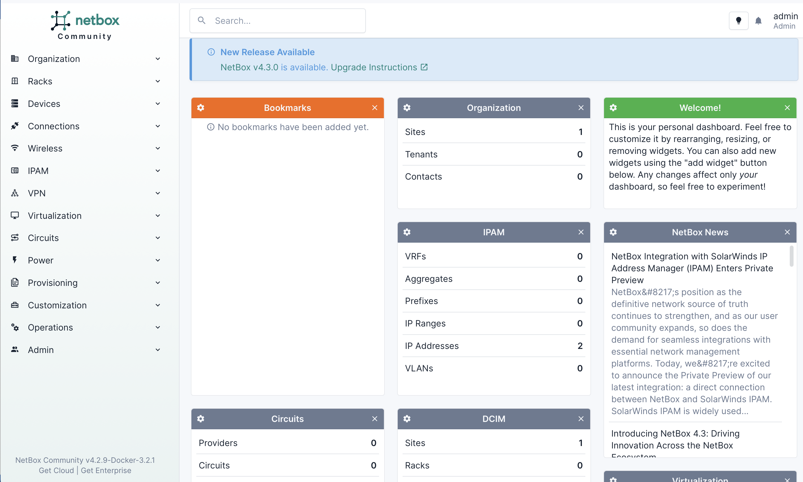
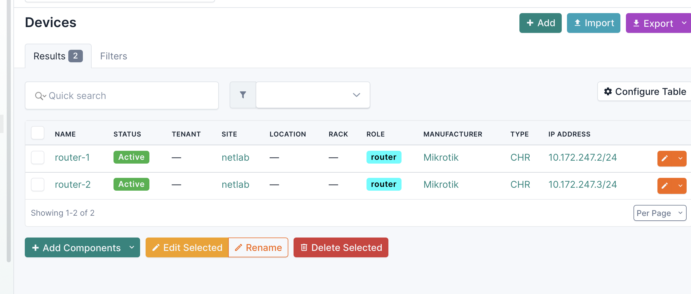
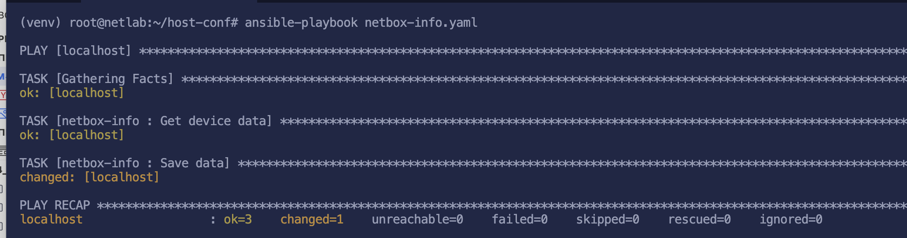
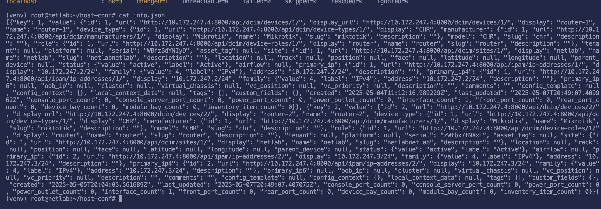
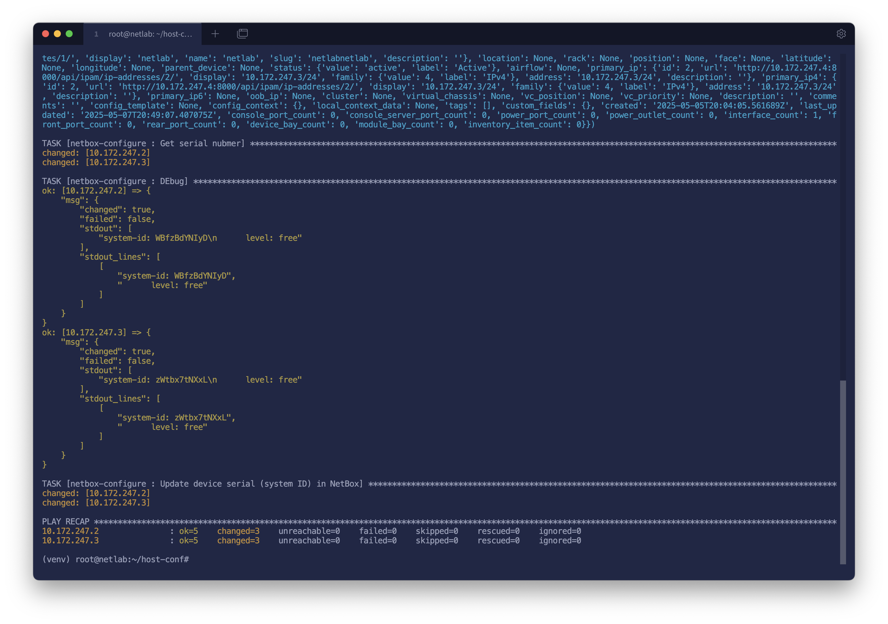
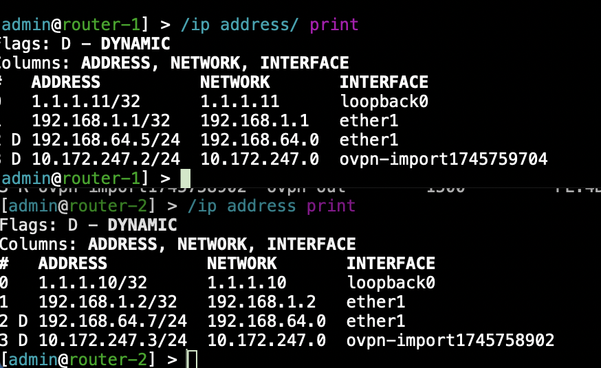
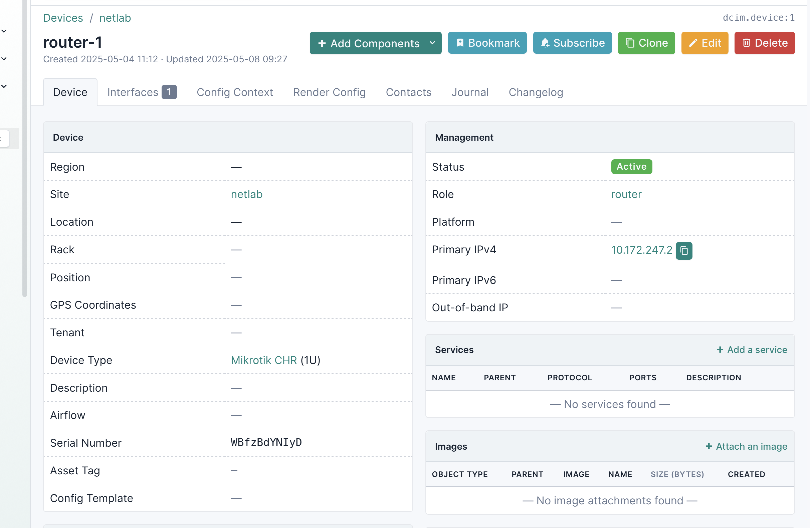
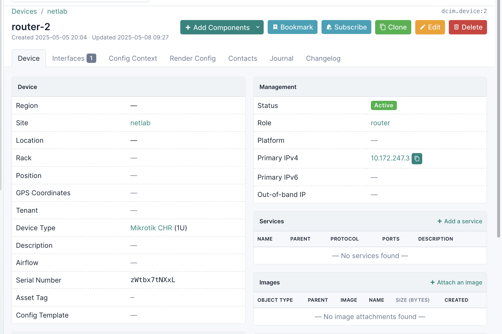

University: [ITMO University](https://itmo.ru/ru/)

Faculty: [PIN](https://fict.itmo.ru)

Course: [Introduction in routing](https://github.com/itmo-ict-faculty/introduction-in-routing)

Year: 2024/2025

Group: K3320

Author: Skvorcov Ivan Vladimirovich

Lab: [Lab3](https://itmo-ict-faculty.github.io/network-programming/education/labs2023_2024/lab1/lab3/)

Date of create: 4.05.2025

Date of finished: 8.05.2025

## Конфигурация netbox

Netbox был развернут на локальной машине с использованием docker compose

```
NAME                                  IMAGE                                         COMMAND                  SERVICE               CREATED      STATUS                  PORTS
netbox-docker-netbox-1                docker.io/netboxcommunity/netbox:v4.2-3.2.1   "/usr/bin/tini -- /o…"   netbox                4 days ago   Up 12 hours (healthy)   0.0.0.0:8000->8080/tcp
netbox-docker-netbox-housekeeping-1   docker.io/netboxcommunity/netbox:v4.2-3.2.1   "/usr/bin/tini -- /o…"   netbox-housekeeping   4 days ago   Up 12 hours (healthy)   
netbox-docker-netbox-worker-1         docker.io/netboxcommunity/netbox:v4.2-3.2.1   "/usr/bin/tini -- /o…"   netbox-worker         4 days ago   Up 12 hours (healthy)   
netbox-docker-postgres-1              docker.io/postgres:17-alpine                  "docker-entrypoint.s…"   postgres              4 days ago   Up 12 hours (healthy)   5432/tcp
netbox-docker-redis-1                 docker.io/valkey/valkey:8.0-alpine            "docker-entrypoint.s…"   redis                 4 days ago   Up 12 hours (healthy)   6379/tcp
netbox-docker-redis-cache-1           docker.io/valkey/valkey:8.0-alpine            "docker-entrypoint.s…"   redis-cache           4 days ago   Up 12 hours (healthy)   6379/tcp
```

Перейдем по адресу `localhost:8000` и увидим, что netbox успешно работает



Далее добавим 2 роутера и добавим им интерфейсы с частными ip адресами внутри vpn. 



Так же, сгенерируем api token, это понадобится на следующем шаге. 

## Конфигурация Ansible

Для получения данных из netbox и синхронизазции данных на устройствах и netbox были созданы две роли [netbox-info](./configs/roles/netbox-info.yaml) и [netbox-configure](./configs/roles/netbox-configure.yaml).

### Получение данных из netbox

Чтоыб получить информацию об устройствах из netbox использовался модуль netbox для ansible. Далее с помощью lookup был вызван API метод и получены нужные данные. Запустим плейбук. 



Плейбук отработал без ошибок, посмотрим что сохранилось в `info.json`.



Данные успешно записались, правда в неформатированном виде


### Конфигурация роутеров

Запустим плейбук конфигурации роутеров, в нем так же будет записана информация о серийных номерах. 



Плейбук пробежал успешно. Проверим, что все применилось.





Как видим, всё успешно применилось.