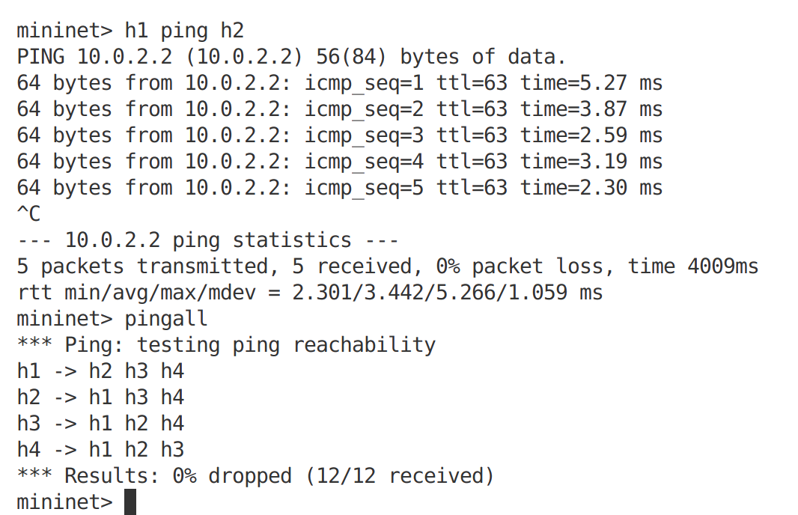
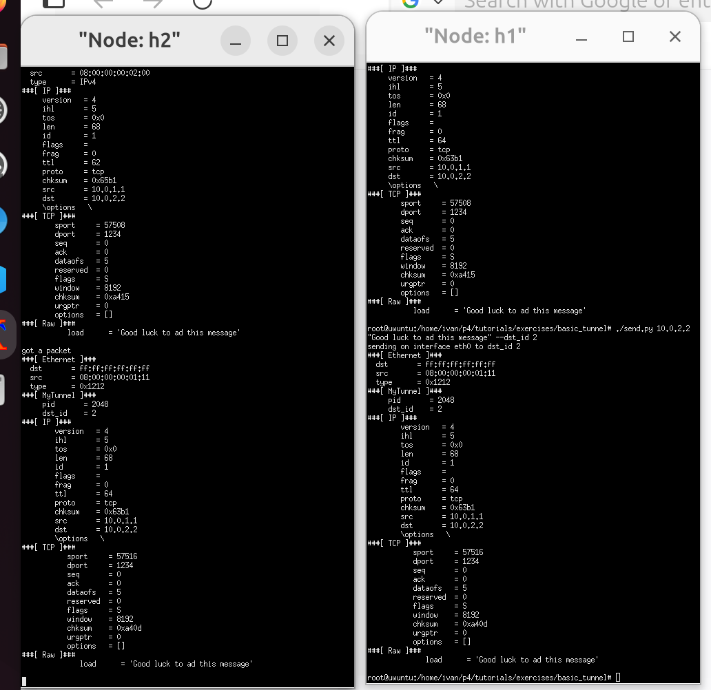

University: [ITMO University](https://itmo.ru/ru/)

Faculty: [PIN](https://fict.itmo.ru)

Course: [Introduction in routing](https://github.com/itmo-ict-faculty/introduction-in-routing)

Year: 2024/2025

Group: K3320

Author: Skvorcov Ivan Vladimirovich

Lab: [Lab3](https://itmo-ict-faculty.github.io/network-programming/education/labs2023_2024/lab1/lab3/)

Date of create: 23.05.2025

Date of finished: 25.05.2025

# Base forwarding

В данном задании нам надо дописать файл, чтобы работала базовая маршрутизация. Для этого дописываем механизм извлечения заголовка (блок ethernet_parse и ipv4_parse). Далее надо дописать логику ингреса, в которой мы будем определять адрес, убавлять ttl и отправлять по таблице пакет, если он валидный конечно. Код можно увидеть в файлу basic.p4. Так же допишем депарсер. Снизу можно увидеть результат пингов

# Basic tunneling

В нем за основу взял код из прошлого задания, однако теперь его надо модифицировать для реализации тунелирования. С этой целью теперь мы парсим заголов myTunnel. Так же надо дописать таблицу, чтобы она работала по полному индентификатору пользователя. В конце, в депарсере добавляем заголовк myTinnel. Снизу можно увидеть скриншоты отправки пакетов (скрины мелкие из-за приколов виртуалк)

